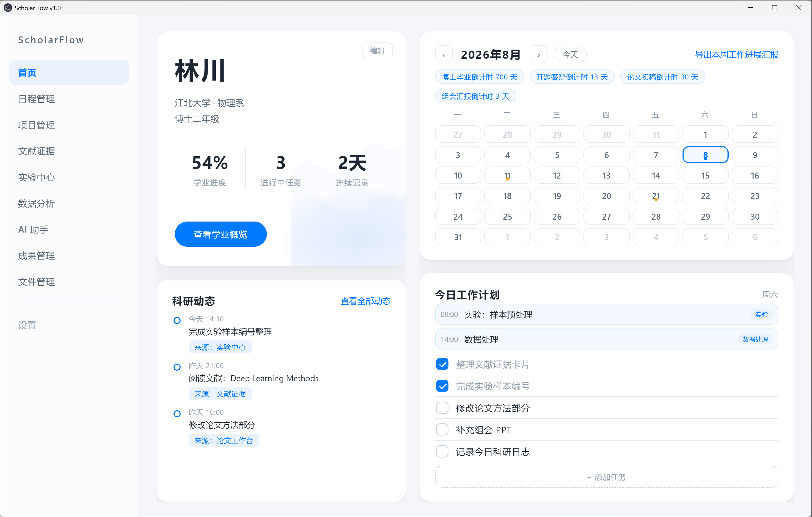
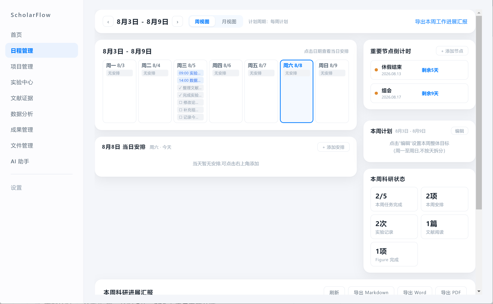
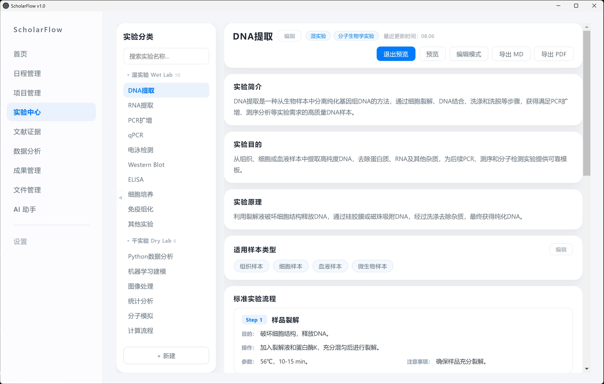
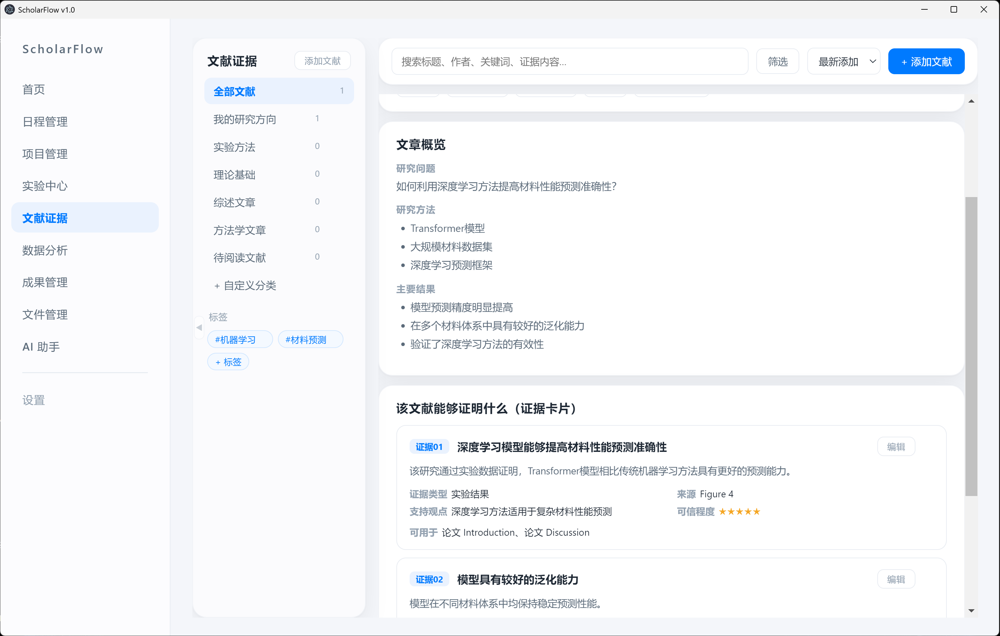

# ScholarFlow

> 面向硕博研究人员的个人科研工作台（Personal Research OS）

从**研究想法 → 实验实施 → 数据分析 → 论文 Figure 构建 → 成果沉淀**,全流程科研资产在一个系统中形成闭环,所有数据保存在本地。

  

---

## 📌 项目简介

ScholarFlow 关注科研过程的**可追溯性**:

- 项目在哪里推进?
- 实验如何完成?
- 数据如何产生?
- Figure 如何构建?
- 论文结论依据是什么?

不同于传统任务管理工具,ScholarFlow 让每一项科研资产(日程、项目、实验、文献、论文、成果)互相联动、随时可查、完整可导出。



## 🧩 功能模块

| 模块 | 描述 |
|---|---|
| 🏠 首页 | 个人信息、学业进度、日历、今日计划、科研动态、重要节点倒计时 |
| 📅 日程管理 | 月历/周历、每日安排(含实验方法与结果)、每周计划、节点倒计时 |
| 📂 项目管理 | 自定义阶段、阶段任务清单、Markdown 笔记、关联内容双向联动 |
| 🧪 实验中心 | 干/湿/自定义分类、实验 SOP 标准流程、关联文献/项目/文件 |
| 📄 文献证据 | 分类/标签、证据卡片、PDF 上传与内置预览 |
| 📊 数据分析 | 论文 Figure 管理、Markdown 写作、目录导航 |
| 🏆 成果管理 | 动态分类、按类型管理、关联文件 |
| 🗂 文件管理 | 统一文件库、回收站、批量操作、内置预览、备份/恢复 |
| 🤖 AI 助手 | 调用 DeepSeek,科研问答与写作辅助 |
| ⚙️ 设置 | 界面/通知/后台常驻/文件与存储/快捷操作 |

---

## 🏠 首页

- **个人信息**:姓名、学校、院系、学位年级,可编辑
- **学业进度**:学分完成率与毕业论文进度的**综合百分比**,实时计算
- **月历**:显示日程、任务与重要节点标记;点击日期 → 今日计划 = 该日**日程 + 任务 + 倒计时节点**同步显示
- **今日工作计划**:可添加/勾选/删除任务,跟随日历选中日期联动
- **科研动态**:实验、文献、论文等操作自动生成时间线
- **重要节点倒计时**:点击节点 → 日历自动跳转到该日期并显示当日计划



## 📅 日程管理

- **月历 / 周历**(周一至周日 7 天)双视图
- **每日安排**:添加/编辑安排(时间、标题、类型),每项可记录**实验方法与实验结果**
- **每周计划**:周一到周日的整体周目标清单(可添加/勾选/删除条目)
- **重要节点倒计时**:节点可增删改;点击节点 → 月历选中该日期 + 当日安排同步
- **导出本周工作进展汇报**:可选导出周(本周/上周等),生成 Markdown / Word / PDF,含每日计划、方法、结果与签字区

public/figure/微信图片_20260808213317_30_114.png

## 📂 项目管理

- **自定义阶段**:项目阶段横向卡片(可折叠/重命名/删除/调整顺序/添加),每阶段有状态与起止时间
- **阶段任务清单**:每阶段下任务可勾选完成,进度 = 已完成任务/总任务;**项目进展百分比按阶段完成情况实时计算**
- **Markdown 笔记**:每阶段独立笔记,编辑/预览自由切换(支持标题、列表、代码块)
- **关联内容**:手动关联实验/文献/论文/成果,双向联动、实时反查;点击直达对应模块具体条目
- **右侧概览**:实时进度环、项目统计、当前问题、时间线(均可编辑)



## 🧪 实验中心

- **动态分类**:干实验/湿实验/自定义分类(可新建、重命名、折叠),分类下可继续新建实验
- **实验 SOP 标准流程**:每个实验含简介/目的/原理/样品类型,步骤可增删改、上下移,预览/编辑模式切换
- **实验验证(关联文献)**:从文献证据库勾选关联,点击直达该文献详情页
- **关联项目**:与项目管理双向联动,点击跳转到具体项目
- **关联文件**:上传 PDF 自动存入统一文件库,可打开/移除
- **导出**:实验内容一键导出 Markdown / PDF



## 📄 文献证据

- **分类管理**:分类可新建/重命名/删除(删除可选保留或连同文章)
- **标签体系**:详情页为文献打标签(输入新标签或点选),左栏标签实时同步;点击标签筛选文献(与分类筛选互斥独立)
- **证据卡片**("该文献能够证明什么"):每篇文献可记录多条证据——证明观点/证据描述/来源位置/证据类型/支持观点/应用位置/可信度,可增删改
- **PDF 管理**:首次点击上传(自动存入文件库)→ 之后直接打开;内置 PDF/文本预览;支持更换 PDF
- **双向关联**:与项目管理、实验中心实时反查联动,点击跳转
- **筛选**:分类、标签、搜索框,任意切换互不干扰

## 📊 数据分析

- **论文 Figure 管理**:每篇论文下有多个 Figure,状态(未开始/进行中/已完成)
- **Markdown 工作区**:每个 Figure 独立写作(Figure 目的/数据来源/方法/结果…),编辑/预览切换
- **目录导航**:正文右侧小目录可一键隐藏(Alt + D)
- 与成果管理"打开论文"、项目管理"论文章节"联动跳转

## 🏆 成果管理

- **动态分类**:全部成果 + 自定义类型(论文/专利/会议/数据/代码/荣誉/团队…可增删改),每个分类常显编辑/删除
- **类型特有字段**:按类型填写专属信息(论文:期刊/IF/分区/角色;专利:专利号/发明人;会议:会议/地点/报告类型;数据:规模/来源项目;代码:语言/功能;荣誉:授予单位;团队:成员/描述)
- **关联文件**:上传文件自动存入文件库,可打开/移除/选择
- 支持新建/编辑/删除/搜索

## 🗂 文件管理

- **统一文件库**:所有模块(文献/实验/成果)上传的文件**按模块名称自动归类**,全部集中在此
- **回收站**:删除的文件先进回收站,可恢复/彻底删除,防误删
- **批量操作**:多选后批量删除/移动分类/下载;上传支持多选
- **内置预览**:PDF、图片、文本(txt/md/json/csv/代码)应用内直接查看
- **搜索/分类筛选/统计**:左侧按模块分类 + 已用空间统计
- **备份/恢复**:一键备份全部数据到文件库,支持恢复历史版本

## 🤖 AI 助手

- 会话管理(新建/重命名/删除/搜索历史)
- 调用 DeepSeek 大模型(需在模块内配置 API Key)
- 本地 Python 代理(server.py),应用启动自动检测并启动
- 支持的科研场景:写作润色、实验设计建议、文献思路梳理
- 正在开发适配的MCP,调用各模块，做到能对你的工作提出思路、设计实验、检查实验等。

## ⚙️ 设置

### 个人资料
姓名、学校、院系、学位年级;影响首页展示与学业概览。

### 界面设置
- **主题**:跟随系统 / 深色 / 浅色
- **字体大小**:小 / 标准 / 大
- **布局模式**:紧凑 / 标准 / 宽屏
- **显示项**:科研动态、日历倒计时、任务完成情况、最近科研活动(可开关)
- **后台常驻**:关闭窗口时最小化到系统托盘(右下角),点击托盘图标恢复;托盘菜单可退出

### 通知提醒
重要节点、实验、组会、周报、每日科研日志等提醒开关(开启后每天首次进入首页弹出提示,不打扰)。

### 文件与存储
- **存储文件夹**:指定科研资料归档位置
- **存储空间**:显示已使用大小
- **数据备份**:自动备份(每天/每周/手动)开关与频率
- **数据导出**:按模块导出全部/日程/项目/实验/文献/数据分析/成果,格式 Markdown / Excel / JSON(JSON 可完整恢复)
- **数据恢复**:恢复历史版本 / 导入备份文件(完整恢复所有模块数据)

### 快捷操作(快捷键)
| 快捷键 | 功能 |
|---|---|
| `Alt + K` | 快速搜索(实验/日程/任务/动态,点击直达) |
| `Alt + P` | 新建项目 |
| `Alt + D` | 数据分析目录显隐 |
| `Alt + J` | 新建科研日志(科研动态) |

### 关于
版本信息、**版本更新**(自动检查 GitHub Releases 并一键更新)、帮助文档(GitHub 链接)、问题反馈。

---

## 🚀 快速开始

### 方式一:桌面版(推荐,Windows)

1. 下载 **Releases** 里的 `ScholarFlow-v1.0.x-win32-x64.zip`
2. 解压,双击 `ScholarFlow.exe` 即可使用(**免安装**)
3. 后续版本更新:设置 → 关于 → 版本更新 → 一键自动更新

### 方式二:浏览器版(开发预览)

```bash
# 直接双击/打开 web/index.html 即可(数据保存在浏览器本地)
```

### 方式三:从源码运行(Electron)

```bash
npm install
npm start
```

---

## 🔒 数据安全

- **全部数据本地存储**:结构化数据(localStorage)+ 上传文件(IndexedDB 文件库),不经过任何云端
- **更新不丢数据**:自动更新只替换程序文件,`%APPDATA%\ScholarFlow`(桌面版)数据原封不动
- **一键备份**:设置 → 文件与存储 → 数据导出(JSON)→ 数据恢复可完整还原
- **换电脑迁移**:复制 `%APPDATA%\ScholarFlow` 整个目录即可

## 🔄 自动更新

- 应用内「设置 → 关于 → 版本更新」自动检查 GitHub Releases 最新版
- 有新版 → 一键下载增量更新包 → 重启自动安装
- 只更新程序,不动任何数据

## ❓ 常见问题

**Q:AI 助手不回复?**
到「AI 助手 → 设置 → API Key」填入 DeepSeek API Key;并确认系统装有 Python(或应用检测到 Python 启动本地代理)。

**Q:换电脑数据怎么迁移?**
复制 `%APPDATA%\ScholarFlow` 目录到新电脑同名位置;或用「数据导出(JSON)→ 导入恢复」迁移结构化数据。

**Q:下一步更新计划?**
Ai功能尚未完善，等测试版调试完后添加MCP模块，联动日程管理等各个模块，做成真正的ai助手。

**Q:如何反馈问题?**
GitHub Issue 或邮件 seanyao9712@163.com。

